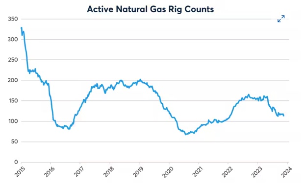
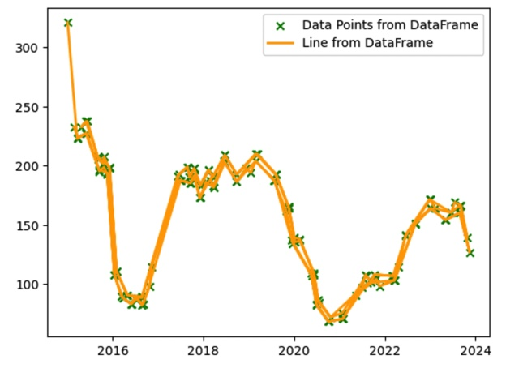

# GraphPoint-Extractor
Performed image processing techniques to extract data points from graph plot.

# Description
This process began with image processing techniques, including loading the image in grayscale, applying GaussianBlur to reduce noise, and using Canny edge detection to identify edges. Contour detection was then employed to isolate the line representing the data points. The largest contour, assumed to represent the data line, was extracted and refined with the Douglas-Peucker algorithm to approximate it with additional points. Subsequently, the image coordinates were converted to data coordinates, providing the x and y points for the graph. To store and visualize this data, a Pandas DataFrame was created, storing the data points and saving them to a CSV file for future use. Finally, Plotly was utilized to create an interactive line graph from the extracted data points, enabling users to explore and analyze the data visually.

# Results

### Original graph

### Generated graph based on the original graph

### Interative plot based on the generated graph
An interactive plot based on the generated graph can be viewed by following this [link](https://cme-assessment-question1.s3.us-east-2.amazonaws.com/check.html).

# Conclusion
In conclusion, the GraphPoint-Extractor project not only successfully extracted data points from a graph image but also provided a user-friendly and interactive platform for visualizing and analyzing the data. This methodology can be valuable in various fields where extracting numerical data from graphical representations is required, such as scientific research, data analysis, and engineering applications.
